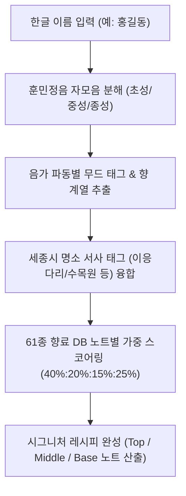

# 훈민향음(訓民香音) 한글 음가 & 향료 매칭 태그 종합 표

- **작성 일자**: 2026년 8월 6일 (260806)
- **목적**: 한글 자모음 파동 무드 분석과 61종 향료 노트(Top, Mid, Base) 및 세종 명소 태그의 정밀 매칭 관계 검증용 문서

---

## 1. 조향 로직 프로세스 (Flowchart)

---

## 2. 한글 음가소리(초성·중성·종성) ➔ 무드 태그 매칭 표

| 분류 | 한글 자모음 그룹 | 추출 무드 태그 (Mood Tags) | 대표 향 계열 (Scent Tags) |
| :--- | :--- | :--- | :--- |
| **초성 (첫인상)** | `ㄱ`, `ㅋ` | `산뜻한`, `또렷한`, `생동감` | 시트러스, 그린 |
| | `ㄴ`, `ㅁ`, `ㅇ` | `부드러운`, `맑은`, `포근한`, `밝은` | 머스크, 플로럴, 워터리 |
| | `ㄷ`, `ㅌ`, `ㄸ` | `단단한`, `세련된`, `지적인` | 우디, 티 |
| | `ㄹ` | `자유로운`, `생동감`, `활력` | 프루티, 허브 |
| | `ㅂ`, `ㅍ`, `ㅃ` | `화려한`, `풍성한`, `관능적인` | 플로럴, 스위트 |
| | `ㅅ`, `ㅈ`, `ㅊ` | `우아한`, `맑은`, `깨끗한` | 플로럴, 티 |
| | `ㅎ` | `따뜻한`, `포근한`, `안정감` | 앰버, 머스크 |
| **중성 (향의 톤)**| `ㅏ`, `ㅑ` | `밝은`, `생동감`, `산뜻한` | 시트러스, 프루티 |
| | `ㅓ`, `ㅕ` | `깊이감`, `차분한`, `우아한` | 우디, 머스크 |
| | `ㅗ`, `ㅛ` | `따뜻한`, `달콤한`, `포근한` | 스윗, 앰버 |
| | `ㅜ`, `ㅠ` | `포근한`, `안정감`, `단단한` | 발삼, 머스크 |
| | `ㅡ`, `ㅣ` | `맑은`, `깨끗한`, `지적인`, `투명한` | 워터리, 티, 그린 |
| **종성 (잔향감)**| `받침 없음` | `산뜻한`, `경쾌한`, `맑은` | 시트러스, 워터리 |
| | `ㄴ`, `ㅁ`, `ㅇ` (울림소리) | `부드러운`, `은은한`, `안정적인` | 머스크, 앰버 |
| | `ㄹ` (유음) | `자유로운`, `풍부한` | 프루티, 우디 |
| | `ㄱ`, `ㄷ`, `ㅂ` 등 (폐쇄음) | `단단한`, `깊이감`, `차분한` | 우디, 레더, 패출리 |

---

## 3. 세종시 대표 명소 ➔ 서사 매칭 태그 표

| 명소 ID | 명소명 (Landmark) | 무드 태그 (Mood Tags) | 보너스 추천 향료 (Bonus Notes) |
| :--- | :--- | :--- | :--- |
| `eung_bridge` | **세종 이응다리** | `활기찬`, `연결되는`, `시원한`, `맑은`, `현대적인` | 베르가못, 마린, 자몽 |
| `sejong_arboretum` | **국립세종수목원** | `싱그러운`, `네이처`, `피톤치드`, `상쾌한`, `자연스러운` | 유칼립투스, 그린티, 시더우드 |
| `government_park` | **정부청사 옥상정원** | `품격있는`, `조화로운`, `서정적인`, `여유로운`, `은은한` | 라벤더, 로즈우드, 자스민 |
| `lake_park` | **세종 호수공원** | `여유로운`, `맑은`, `평화로운`, `탁트인`, `잔잔한` | 마린, 라임, 뮤게 |
| `presidential_archives` | **대통령기록관** | `정갈한`, `진정성`, `기품있는`, `단아한`, `고풍스러운` | 시더우드, 화이트 머스크, 패출리 |
| `hunmin_studio` | **훈민향음 공방** | `창의적인`, `몰입`, `감성적인`, `특별한`, `아뜰리에` | 블랙티, 피오니, 샌달우드 |

---

## 4. 전체 61종 향료 노트별 통합 매칭 표

### 🍊 탑 노트 (Top Notes - 20종)
| 향료명 (한글/영문) | 무드 태그 (Mood Tags) | 향 계열 (Scent Tags) |
| :--- | :--- | :--- |
| **스위트 오렌지** (Sweet Orange) | `밝은`, `따뜻한`, `생동감`, `산뜻한`, `달콤한` | 시트러스, 프루티 |
| **스트로베리** (Strawberry) | `귀여운`, `로맨틱한`, `달콤한`, `생동감` | 프루티 |
| **블랙티** (Black Tea) | `지적인`, `세련된`, `차분한`, `깊이감` | 티 |
| **유칼립투스** (Eucalyptus) | `깨끗한`, `시원한`, `맑은`, `자유로운` | 허브, 그린 |
| **시트러스 프루트** (Citrus fruit) | `밝은`, `산뜻한`, `생동감`, `귀여운` | 시트러스, 프루티 |
| **만다린** (Mandarine) | `밝은`, `산뜻한`, `쌉쌀한`, `따뜻한` | 시트러스 |
| **핑크 피치** (Pink Peach) | `부드러운`, `귀여운`, `로맨틱한`, `달콤한` | 프루티 |
| **체리** (Cheery) | `개성`, `달콤한`, `깊이감`, `신비로운` | 프루티 |
| **파인애플** (Pineapple) | `밝은`, `자유로운`, `생동감`, `열대적인` | 프루티 |
| **베르가못** (Bergamot) | `세련된`, `맑은`, `산뜻한`, `균형감` | 시트러스, 티 |
| **그린** (Green) | `맑은`, `깨끗한`, `투명한`, `차분한` | 그린, 워터리 |
| **그린티** (Green tea) | `차분한`, `지적인`, `아로마틱`, `깨끗한` | 티, 그린 |
| **마린** (Marine) | `맑은`, `투명한`, `시원한`, `깨끗한` | 워터리 |
| **라임** (Lime) | `산뜻한`, `또렷한`, `생동감`, `시원한` | 시트러스 |
| **자몽** (Grapefruit) | `세련된`, `산뜻한`, `쌉쌀한`, `밝은` | 시트러스 |
| **레몬** (Lemon) | `밝은`, `깨끗한`, `산뜻한`, `또렷한` | 시트러스 |
| **애플** (Apple) | `맑은`, `귀여운`, `산뜻한`, `생동감` | 프루티, 그린 |
| **스피어민트** (Spearmint) | `시원한`, `활력`, `자유로운`, `깨끗한` | 허브, 그린 |
| **파인** (Pine) | `단단한`, `숲`, `신선한`, `깊이감` | 우디, 그린 |
| **페티그레인** (Petitgrain) | `그린`, `세련된`, `자연스러운`, `산뜻한` | 그린, 시트러스 |

### 🌸 미들 노트 (Middle Notes - 21종)
| 향료명 (한글/영문) | 무드 태그 (Mood Tags) | 향 계열 (Scent Tags) |
| :--- | :--- | :--- |
| **피오니** (Peony) | `부드러운`, `맑은`, `우아한`, `깨끗한` | 플로럴 |
| **히아신스** (Hyacinth) | `생동감`, `깨끗한`, `그린`, `세련된` | 플로럴, 그린 |
| **라일락** (Lilac) | `부드러운`, `포근한`, `파우더리`, `깨끗한` | 플로럴 |
| **바이올렛** (Violet) | `중성적인`, `부드러운`, `파우더리`, `세련된` | 플로럴 |
| **로즈** (Rose) | `우아한`, `로맨틱한`, `깨끗한`, `여성스러운` | 플로럴 |
| **핑크페퍼** (Pink pepper) | `자신감`, `개성`, `세련된`, `스파이시` | 스파이시 |
| **로즈마리** (Rosemary) | `지적인`, `깨끗한`, `아로마틱`, `신선한` | 허브 |
| **체리블라썸** (cheery blossom) | `귀여운`, `로맨틱한`, `밝은`, `캐주얼` | 플로럴 |
| **일랑일랑** (Ylang Ylang) | `화려한`, `관능적인`, `달콤한`, `깊이감` | 플로럴, 우디 |
| **무화과** (Fig) | `부드러운`, `크리미`, `자연스러운`, `개성` | 프루티, 그린 |
| **프리지아** (Freesia) | `밝은`, `따뜻한`, `산뜻한`, `부드러운` | 플로럴 |
| **자스민** (Jasmine) | `화려한`, `우아한`, `관능적인`, `깊이감` | 플로럴 |
| **캐모마일** (Chamomile) | `차분한`, `부드러운`, `단아한`, `편안한` | 티, 플로럴 |
| **네롤리** (Neroli) | `밝은`, `세련된`, `허브`, `플로럴` | 플로럴, 시트러스 |
| **오렌지 블러썸** (Orange blossom)| `밝은`, `귀여운`, `산뜻한`, `플로럴` | 플로럴 |
| **제라늄** (Geranium) | `중성적인`, `로맨틱한`, `자연스러운`, `플로럴` | 플로럴 |
| **배 향** (Korean Pear) | `맑은`, `산뜻한`, `달콤한`, `부드러운` | 프루티 |
| **블러썸 부케** (Blossom Bouquet)| `화려한`, `우아한`, `풍성한`, `여성스러운` | 플로럴 |
| **뮤게** (Muguet) | `맑은`, `깨끗한`, `투명한`, `부드러운` | 플로럴, 워터리 |
| **주니퍼 베리** (Juniper berry) | `숲`, `신선한`, `중성적인`, `시원한` | 우디, 허브 |
| **사이프러스** (Cypress) | `차분한`, `숲`, `아로마틱`, `단단한` | 우디, 그린 |

### 🪵 베이스 노트 (Base Notes - 20종)
| 향료명 (한글/영문) | 무드 태그 (Mood Tags) | 향 계열 (Scent Tags) |
| :--- | :--- | :--- |
| **상딸** (Santal) | `부드러운`, `크리미`, `우디`, `따뜻한` | 우디 |
| **화이트 머스크** (White Musk) | `포근한`, `깨끗한`, `부드러운`, `파우더리` | 머스크 |
| **화이트 앰버** (White Amber) | `부드러운`, `따뜻한`, `안정감`, `고급스러운` | 앰버, 머스크 |
| **블랙 머스크** (Black Musk) | `세련된`, `중성적인`, `깊이감`, `쌉쌀한` | 머스크, 우디 |
| **바닐라** (Vanilla) | `달콤한`, `따뜻한`, `포근한`, `부드러운` | 발삼, 스윗 |
| **로즈우드** (Rosewood) | `부드러운`, `중성적인`, `우디`, `안정감` | 우디, 플로럴 |
| **베티버** (Vetiver) | `단단한`, `차분한`, `깊이감`, `우디` | 우디 |
| **머스크 T** (Musk T) | `깨끗한`, `포근한`, `파우더리`, `편안한` | 머스크 |
| **앰버** (Amber) | `따뜻한`, `안정감`, `깊이감`, `고급스러운` | 앰버 |
| **샌달우드** (Sandalwood) | `우디`, `차분한`, `부드러운`, `안정감` | 우디 |
| **시더우드** (Cedarwood) | `단단한`, `우디`, `드라이`, `세련된` | 우디 |
| **오우드** (Oud) | `고급스러운`, `깊이감`, `차분한`, `단단한` | 우디 |
| **코코넛** (Coconut) | `달콤한`, `크리미`, `부드러운`, `열대적인` | 스윗 |
| **리치** (Lychee) | `달콤한`, `생동감`, `귀여운`, `산뜻한` | 프루티, 스윗 |
| **참파카** (Champaca) | `화려한`, `관능적인`, `플로럴`, `고급스러운` | 플로럴 |
| **리프** (Leaf) | `중성적인`, `그린`, `깨끗한`, `자유로운` | 그린, 머스크 |
| **진저** (Ginger) | `스파이시`, `산뜻한`, `생동감`, `또렷한` | 스파이시 |
| **브라운 우드** (Brown Wood) | `따뜻한`, `깊이감`, `우디`, `고급스러운` | 우디, 스파이시 |
| **레더** (Leather) | `단단한`, `스모키`, `개성`, `고급스러운` | 레더, 우디 |
| **패출리** (Patchouli) | `깊이감`, `우디`, `얼씨`, `차분한` | 우디 |
